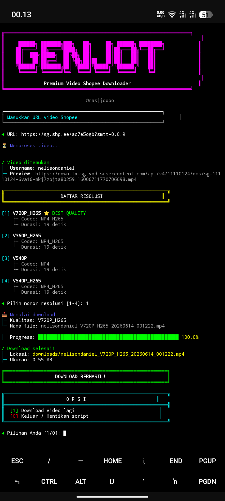

# 🎬 Sopi Vidi - Shopee Video Downloader


> **Sopi Vidi** adalah tools downloader video Shopee yang powerful dengan tampilan interaktif, animasi warna-warni, dan dukungan kualitas terbaik (V720P).

<div align="center">
  
</div>

## ✨ Fitur Unggulan

- 🎨 **Tampilan Warna-warni** - UI profesional dengan animasi loading
- 📥 **Download Cepat** - Support resume dan progress bar realtime
- ⭐ **Best Quality Priority** - Resolusi V720P otomatis di urutan pertama
- 🔄 **Loop Mode** - Bisa download banyak video tanpa restart
- 🎯 **Multiple Resolusi** - Support V720P, V480P, V360P, dan lainnya
- 📁 **Auto Organize** - File tersimpan rapi di folder `downloads/`
- 🚀 **Single URL Mode** - Download langsung via command line
- 💻 **Cross Platform** - Support Linux, Termux, Windows, macOS

## 📋 Prasyarat

- Python 3.7 atau lebih baru
- Koneksi internet stabil
- Module `requests` dan `colorama`

## 🚀 Cara Instalasi

### Termux / Linux
```bash
# Clone repository
git clone https://github.com/masjjoooo/sopi-vidi.git
cd sopi-vidi

# Install requirements
pip install -r requirements.txt

# Jalankan script
python sopi_vidi.py
```

Windows

```bash
# Clone repository
git clone https://github.com/masjjoooo/sopi-vidi.git
cd sopi-vidi

# Install requirements
pip install -r requirements.txt

# Jalankan script
python sopi_vidi.py
```

One-Line Install (Termux)

```bash
pkg update && pkg upgrade
pkg install python git
git clone https://github.com/masjjoooo/sopi-vidi.git
cd sopi-vidi
pip install -r requirements.txt
python sopi_vidi.py
```

📖 Cara Penggunaan

Mode Interaktif

```bash
python sopi_vidi.py
```

Kemudian ikuti petunjuk:

1. Masukkan URL video Shopee
2. Pilih resolusi yang diinginkan
3. Tunggu proses download selesai
4. Pilih download lagi atau keluar

Mode Single URL

```bash
python sopi_vidi.py -u "https://shopee.co.id/video/xxx"
```

Bantuan

```bash
python sopi_vidi.py -h
```

🎯 Contoh Penggunaan

```bash
$ python sopi_vidi.py

╔══════════════════════════════════════════════════════════════════╗
║                                                                      ║
║     ██████╗ ███████╗███╗   ██╗     ██╗ ██████╗ ████████╗            ║
║    ██╔════╝ ██╔════╝████╗  ██║     ██║██╔═══██╗╚══██╔══╝            ║
║    ██║  ███╗█████╗  ██╔██╗ ██║     ██║██║   ██║   ██║               ║
║    ██║   ██║██╔══╝  ██║╚██╗██║██   ██║██║   ██║   ██║               ║
║    ╚██████╔╝███████╗██║ ╚████║╚█████╔╝╚██████╔╝   ██║               ║
║     ╚═════╝ ╚══════╝╚═╝  ╚═══╝ ╚════╝  ╚═════╝    ╚═╝               ║
║                                                                      ║
║         Premium Shopee Video Downloader v2.0.0                  ║
╚══════════════════════════════════════════════════════════════════╝
                              ©masjjoooo

➜ URL: https://shopee.co.id/video/xxxxx

✓ Video ditemukan!
├─ Username: shopee_user
├─ Preview: https://...

Daftar Resolusi:

[1] V720P ⭐ BEST QUALITY
    ├─ Codec: h264
    └─ Durasi: 60 detik

[2] V480P
    ├─ Codec: h264
    └─ Durasi: 60 detik

➜ Pilih nomor resolusi [1-2]: 1

📥 Memulai download...
├─ Kualitas: V720P
└─ Nama file: shopee_user_V720P_20231201_123456.mp4

Progress: ████████████████████████████████████████ 100.0%

✓ Download selesai!
├─ Lokasi: downloads/shopee_user_V720P_20231201_123456.mp4
├─ Ukuran: 15.23 MB

╔══════════════════════════════════════════════════════════╗
║                      O P S I                         ║
╠══════════════════════════════════════════════════════════╣
║  [1] Download video lagi                              ║
║  [0] Keluar / Hentikan script                         ║
╚══════════════════════════════════════════════════════════╝

➜ Pilihan Anda [1/0]:
```

📁 Struktur Output

```
sopi-vidi/
├── downloads/
│   ├── username_V720P_20231201_123456.mp4
│   ├── username_V480P_20231201_123457.mp4
│   └── ...
├── sopi_vidi.py
└── requirements.txt
```

⚙️ Konfigurasi

Script ini menggunakan API dari shopeenowatermark.com. Tidak diperlukan konfigurasi tambahan.

🐛 Troubleshooting

Error: "Module not found"

```bash
pip install -r requirements.txt
```

Error: "Connection timeout"

· Periksa koneksi internet
· Coba gunakan VPN jika diperlukan

Error: "No stream found"

· Pastikan URL video Shopee valid
· Video mungkin private atau sudah dihapus

🤝 Kontribusi

Pull request sangat diterima! Untuk perubahan besar, silakan buka issue terlebih dahulu.

📝 Changelog

v2.0.0 (2024)

· ✨ Added loop mode (download multiple videos)
· 🎨 Enhanced UI with better colors
· ⭐ Best quality auto-priority
· 🚀 Single URL mode support
· 📊 Improved progress bar

v1.0.0

· Initial release
· Basic download functionality
· Multiple resolution support

📄 Lisensi

Distributed under the MIT License. See LICENSE for more information.

👤 Author

masjjoooo

· GitHub: @masjjoooo

⭐ Support

Jika Anda menyukai project ini, berikan ⭐ di GitHub!

---

<div align="center">
  Made with ❤️ by masjjoooo
</div>
```

4. LICENSE (MIT License)

```txt
MIT License

Copyright (c) 2024 masjjoooo

Permission is hereby granted, free of charge, to any person obtaining a copy
of this software and associated documentation files (the "Software"), to deal
in the Software without restriction, including without limitation the rights
to use, copy, modify, merge, publish, distribute, sublicense, and/or sell
copies of the Software, and to permit persons to whom the Software is
furnished to do so, subject to the following conditions:

The above copyright notice and this permission notice shall be included in all
copies or substantial portions of the Software.

THE SOFTWARE IS PROVIDED "AS IS", WITHOUT WARRANTY OF ANY KIND, EXPRESS OR
IMPLIED, INCLUDING BUT NOT LIMITED TO THE WARRANTIES OF MERCHANTABILITY,
FITNESS FOR A PARTICULAR PURPOSE AND NONINFRINGEMENT. IN NO EVENT SHALL THE
AUTHORS OR COPYRIGHT HOLDERS BE LIABLE FOR ANY CLAIM, DAMAGES OR OTHER
LIABILITY, WHETHER IN AN ACTION OF CONTRACT, TORT OR OTHERWISE, ARISING FROM,
OUT OF OR IN CONNECTION WITH THE SOFTWARE OR THE USE OR OTHER DEALINGS IN THE
SOFTWARE.
```
